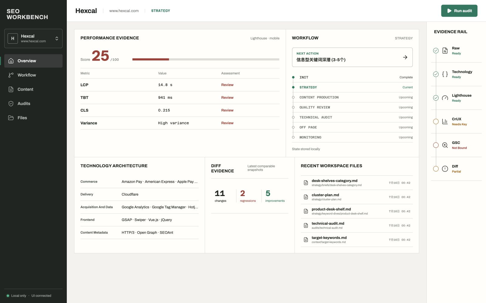
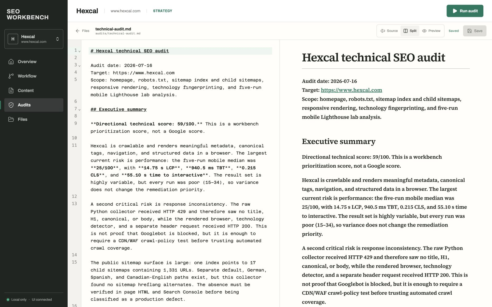
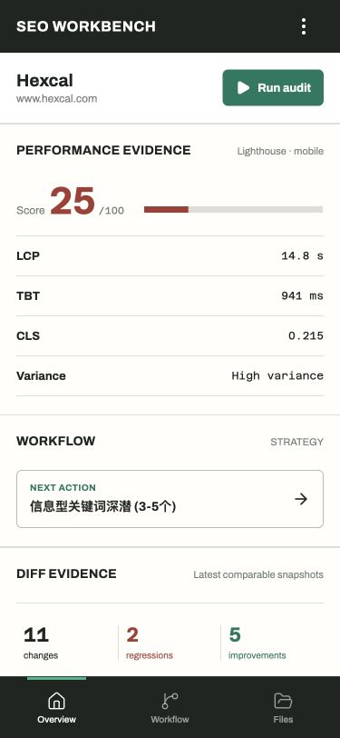

# SEO Workbench


A local-first workspace for technical SEO audits, content planning, and repeatable evidence collection. Use it from the CLI, let an AI coding agent operate it, or open the optional browser interface.



The screenshot above shows a real project workspace. Audit evidence, workflow state, technology findings, performance results, and working documents stay together instead of being scattered across one-off reports.

---
Todo:
- [X] tech stack recognization: wappalyzergo integration
- [X] laboratory test: Lighthouse 本地多次采样与代表结果
- [X] real UX: CrUX 当前值与 40 周历史
- [X] 多店铺管理
- [X] 审计diff
- [X] GSC 只读接入
- [X] cli improvement: 本地 `./seo` / `seo-workbench` 命令
- [X] optional local workbench UI + Markdown editor
- [X] docs: readme重写
- [ ] 定时功能

---

## What it does

| Area | Included capabilities |
| --- | --- |
| Site evidence | Raw HTML, redirects, metadata, robots.txt, Sitemaps, representative routes, and rendered browser checks |
| Technology | Wappalyzer-style detection with architecture and SEO impact analysis |
| Performance | Repeatable multi-run Lighthouse audits plus CrUX field data and 40-week history |
| Search Console | Read-only Search Analytics, URL Inspection, and Sitemap status collection |
| Change tracking | Comparable diffs for raw, technology, Lighthouse, CrUX, and GSC evidence |
| SEO workflow | Strategy, content briefs, production, quality review, technical audits, backlinks, and monitoring |
| Project management | One local folder per site, with private runtime data excluded from Git |

SEO Workbench is agent-neutral. Codex, Claude Code, or another coding agent can use the same `./seo` commands, project files, and local skills. The CLI remains the source of truth when the UI is closed.

## Quick start

```bash
git clone https://github.com/xolarvill/seo-workbench.git
cd seo-workbench
./setup.sh
```

### Working manually

Create a project and collect its first evidence:

```bash
./seo --project my-site init general \
  --name "My Site" --url "https://example.com"

./seo --project my-site evidence --rendered --technology --json
./seo --project my-site performance --json
```

Open the workbench:

```bash
./seo --project my-site ui
```

The interface only listens on `127.0.0.1`. It is optional and uses the same local project files as the CLI.

### Working with an agent

Run your coding agent from the repository root and give it the project ID. A useful first request is:

> Audit the `my-site` project, explain the technical and performance findings, then prepare a content SEO strategy using the local workbench.

Agents can discover the current workflow step with:

```bash
./seo --project my-site status --json
./seo --project my-site next --json
```

When the UI is open, new audit files and Markdown documents appear there automatically.

## Workbench interface

The browser interface includes project switching, evidence status, audit actions, workflow progress, file browsing, and a Markdown editor with source, split, and preview modes.



The editor checks file revisions before saving. If an agent changes the same document, the UI preserves your local edit and asks you to compare or reload instead of overwriting either version.

<details>
<summary>Mobile layout</summary>

<p align="center">
  
</p>

</details>

## Common commands

```bash
# Projects and workflow
./seo projects --json
./seo --project my-site status --json
./seo --project my-site next
./seo --project my-site step done

# Technical evidence
./seo --project my-site evidence --rendered --json
./seo --project my-site technology --json
./seo --project my-site performance --json

# Google evidence, after configuration
./seo --project my-site crux --json
./seo --project my-site gsc collect --json

# Compare recent compatible snapshots
./seo --project my-site audit-diff --json

# Environment and project checks
./seo --project my-site validate --json
./seo --project my-site doctor --json
./setup.sh --check
```

Use `./seo --help` and `./seo <command> --help` for the full command reference.


## Optional Google integrations

CrUX requires a Google API key. GSC supports desktop OAuth and service accounts, requests read-only access, and never submits Sitemaps or indexing requests.

See [Google integrations](docs/google-integrations.md) for setup, authentication, evidence scopes, and status meanings.

## Setup requirements

`./setup.sh` creates the Python environment, installs the pinned Python and Node dependencies, builds the Go technology helper and browser UI, and resolves Chrome or Chromium for rendered audits and Lighthouse.

Automatic installation of missing system runtimes currently requires macOS and Homebrew. On other systems, install these prerequisites first:

- Git
- uv
- Python 3.11
- Go 1.25 or newer
- Node.js 24
- Chrome or Chromium

## Documentation

- [SEO tutorial index](docs/README.md)
- [Google integrations](docs/google-integrations.md)
- [Standalone workbench architecture](docs/independent-workbench.md)
- [Preserved SEO capability families](docs/capability-preservation.md)

## Current boundaries

- The workbench has no built-in scheduler or hosted server.
- One project represents one site. Use separate project folders for separate sites or stores.
- Lighthouse lab data, CrUX field data, and GSC search data remain separate evidence sources.
- GSC OAuth requires the user to approve the first browser authorization.
- Local probes reject private network targets by default, but they are not a complete sandbox for malicious websites.

## Credits

SEO Workbench preserves and adapts useful ideas and material from:

- [claude-seo](https://github.com/AgriciDaniel/claude-seo)
- [seomachine](https://github.com/TheCraigHewitt/seomachine)
- [superseo-skills](https://github.com/inhouseseo/superseo-skills)
- [wappalyzergo](https://github.com/projectdiscovery/wappalyzergo)
- [Lighthouse](https://github.com/GoogleChrome/lighthouse)

See the local skill and third-party attribution files for component-specific terms.

## License

[MIT](LICENSE)
