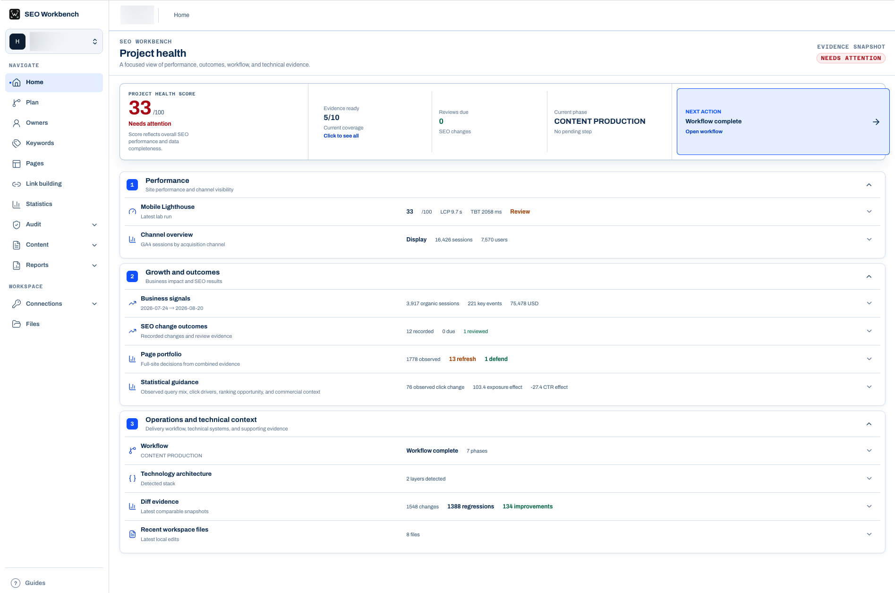
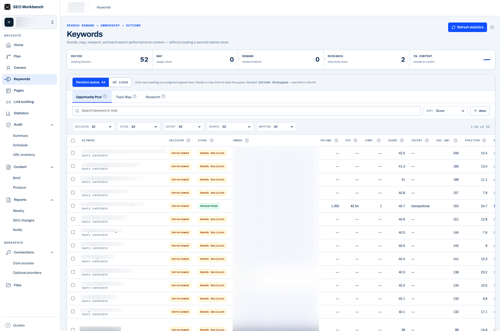
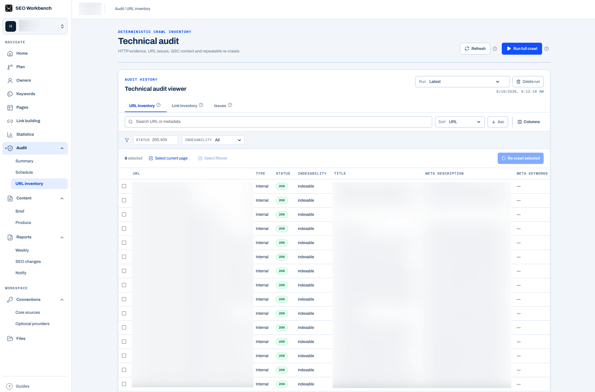
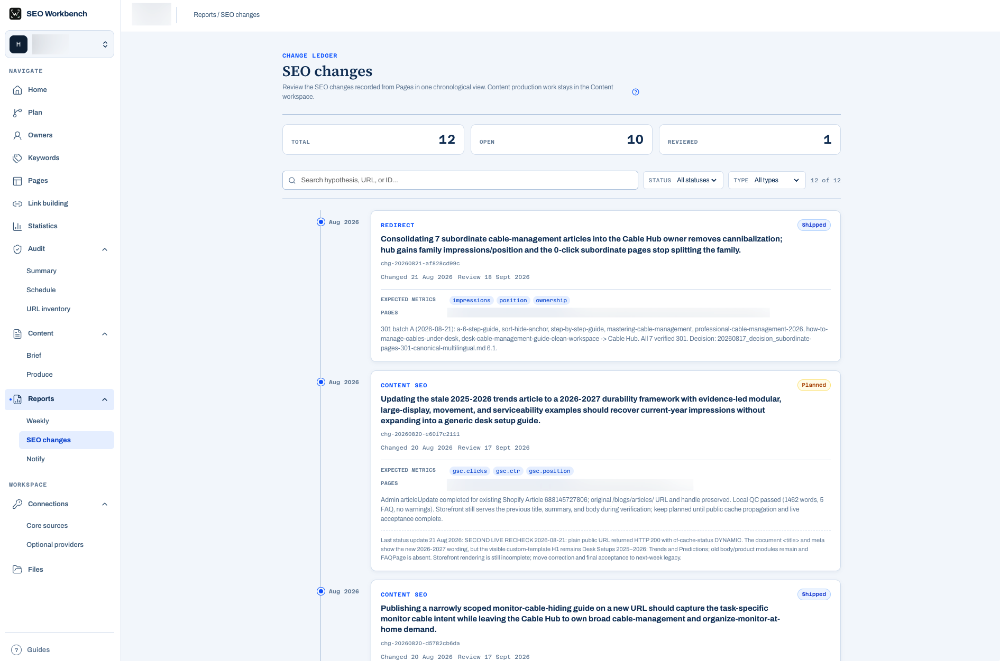

# SEO Workbench

A local-first all-in-one SEO workspace. Use it from an AI coding agent and manage the visual browser interface. Progress your work in weekly paces.

1. Overview 


2. Keywords


3. Technical audit


4. Book SEO changes


## What it does

- **Site & Tech Evidence**
    - HTML, metadata, robots.txt, sitemaps, routes, rendered checks
      - [Technical Audit Issue Catalog](#technical-audit-issue-catalog)
    - Wappalyzer-style stack detection with architecture & SEO analysis
- **Performance & GSC Integration**
    - Multi-run Lighthouse, CrUX field data, 40-week history
    - Read-only analytics, URL inspection, sitemap status
- **E-commerce (Shopify)**
    - Revenue/orders, GA4 organic funnel, all-channel tracking
- **Crawl & Change Tracking**
    - Inventory, rules, issue tracking, CLI runs, Feishu alerts
    - Evidence diffs, SEO change ledger, outcome review
- **Page & Content Operations**
    - Page inventory, query conflicts, action projections
    - Production state, page-level sessions/conversions/revenue
- **Keyword Planning**
    - Discover → map → research → produce workflow
- **Off-page Evidence**
    - Backlinks, DataForSEO snapshots, gap analysis, 404 reclaims
- **Project & Workflow Management**
    - Local site folders, Git-excluded runtime data
    - Weekly-based SEO work advancement

## Quick start

```bash
git clone https://github.com/xolarvill/seo-workbench.git
cd seo-workbench
./setup.sh # set up all the environment requirements
./seo ui # open the visual managing interface
```

### Working with an agent

Run your coding agent from the repository root. SEO Workbench is agent-neutral. Codex, Claude Code, or another coding agent can use the same `./seo` commands, project files, and local skills. The CLI remains the source of truth when the UI is closed.

 A useful first request is:
> Audit the `my-site` project, explain the technical and performance findings, then prepare a content SEO strategy using the local workbench. Give me a report of what should be done in this week.

Agents can discover the current workflow step, use the skills stored in local workbench. When the UI is open, new audit files and Markdown documents appear there automatically.

### Working manually

Manual operation is supported, create a project and collect its first evidence:

```bash
./seo --project my-site init general \
  --name "My Site" --url "https://example.com"

./seo --project my-site evidence --rendered --technology --json
./seo --project my-site performance --json
```

Open the workbench:

```bash
./seo --project my-site ui
```

The interface listens only on the local machine and uses the same project files as the CLI. Open the printed `http://localhost:<port>` address in any browser; no browser-specific session is required.

## Workflow

- Weekly Cadence: One file per week (YYYY_week_WW_work_done.md), updated in place; unfinished tasks auto-carry into the next week’s overview.
- Task Archive: Ad-hoc decisions stored as YYYYMMDD_<category>_<topic>.md, searchable by category, year, or keyword.


## Documentation

A long listed documentation for user.

### Technical audit issue

Click below to open dropdown for details

<details>
<summary id="technical-audit-issue-catalog">Technical audit issue catalog</summary>

This is the rule catalog the technical audit can detect. It is not a claim that every issue currently exists in a project; use `./seo --project <id> tech-audit issues list --json` for the latest project findings.

**HTTP and redirects**

- `HTTP_4XX` — Internal URL returns 4xx
- `HTTP_5XX` — Internal URL returns 5xx
- `REDIRECT_CHAIN` — Redirect chain
- `REDIRECT_LOOP` — Redirect loop

**Links**

- `BROKEN_INTERNAL_LINK` — Broken internal link
- `ORPHAN_CANDIDATE` — Orphan candidate
- `NO_INTERNAL_INLINKS` — No internal inlinks

**Metadata**

- `MISSING_TITLE` — Missing title
- `DUPLICATE_TITLE` — Duplicate title
- `MISSING_META_DESCRIPTION` — Missing meta description
- `DUPLICATE_META_DESCRIPTION` — Duplicate meta description

**Content**

- `MISSING_H1` — Missing H1
- `MULTIPLE_H1` — Multiple H1 headings
- `DUPLICATE_CONTENT_HASH` — Duplicate content

**Indexability**

- `MISSING_CANONICAL` — Missing canonical
- `CANONICAL_TO_NON_200` — Canonical points to non-200
- `CANONICAL_CONFLICT` — Conflicting canonical
- `CROSS_DOMAIN_CANONICAL` — Cross-domain canonical
- `ACCIDENTAL_NOINDEX` — Accidental noindex
- `BLOCKED_BY_ROBOTS` — Blocked by robots.txt

**Sitemaps**

- `SITEMAP_NON_200` — Sitemap returns non-200
- `SITEMAP_NOINDEX` — Sitemap URL is noindex
- `CRAWLED_NOT_IN_SITEMAP` — Crawled URL missing from sitemap
- `SITEMAP_NOT_CRAWLED` — Sitemap URL not crawled

**Internationalization**

- `HREFLANG_INVALID_CODE` — Invalid hreflang code
- `HREFLANG_MISSING_RETURN_LINK` — Missing hreflang return link
- `HREFLANG_TO_NON_200` — Hreflang points to non-200

**Architecture**

- `HIGH_CRAWL_DEPTH` — High crawl depth
- `HTTP_HTTPS_MIX` — HTTP/HTTPS mix
- `WWW_NON_WWW_MIX` — WWW/non-WWW mix

**Performance**

- `SLOW_RESPONSE` — Slow response
- `LARGE_HTML` — Large HTML response

</details>


### Common commands

```bash
# Projects and workflow
./seo projects --json
./seo --project my-site status --json
./seo --project my-site next
./seo --project my-site step done
./seo --project my-site keywords collect --google-ads-csv google-ads.csv --semrush-xlsx semrush.xlsx --json

# Technical evidence
./seo --project my-site evidence --rendered --json
./seo --project my-site technology --json
./seo --project my-site performance --json
./seo --project my-site tech-audit run --json
./seo --project my-site tech-audit recrawl --url https://example.com/missing --json
./seo --project my-site tech-audit diff --json
./seo --project my-site tech-audit issues list --status open --json
./seo --project my-site tech-audit issues status <fingerprint> fixed --owner seo --note "deployed" --json

# Google evidence, after configuration
./seo --project my-site crux --json
./seo --project my-site gsc collect --json
./seo --project my-site statistics collect --json

# Compare recent compatible snapshots
./seo --project my-site audit-diff --json

# Workbench-led Blog production
./seo --project my-site content cluster-brief --json
./seo --project my-site content import-clusters --from-file clusters.json --json
./seo --project my-site content status <item_id> ready_to_write --note "topic approved" --json
./seo --project my-site content brief <item_id> --json
./seo --project my-site content import-draft --from-file article.json --json
./seo --project my-site content qc <item_id> --json
./seo --project my-site content status <item_id> approved --note "human approved" --json
./seo --project my-site content publish-dry-run <item_id> --blog-id <blog_id> --json
./seo --project my-site content publish <item_id> --blog-id <blog_id> --confirm --json
./seo --project my-site gsc inspect --limit 10 --json
./seo --project my-site content index-status --notify-role seo --profile my-site --confirm --json
./seo --project my-site pages refresh --json

# Reporting archive
./seo --project my-site reports list --json
./seo --project my-site reports new --json
./seo --project my-site reports presentation status --json
./seo --project my-site reports presentation generate --json

# Record a shipped SEO change, then evaluate it after the review window
./seo --project my-site changes add --url https://example.com/page --type content \
  --hypothesis "Improve qualified clicks" --metric clicks --metric conversions --json
./seo --project my-site business-signals import --from-file business-signals.csv --json
./seo --project my-site changes evaluate <change_id> --json

# Import repeatable backlink exports from any provider
./seo --project my-site backlinks import --from-file backlinks.csv --source semrush --json
./seo --project my-site backlinks status --source semrush --json

# Optional paid DataForSEO evidence (uses project-private BYOK credentials)
./seo --project my-site backlinks collect --confirm-paid --json
./seo --project my-site backlinks gap --competitor competitor-a.com \
  --competitor competitor-b.com --confirm-paid --json

# Environment and project checks
./seo --project my-site validate --json
./seo --project my-site doctor --json
./setup.sh --check
```

Use `./seo --help` and `./seo <command> --help` for the full command reference.

### Operation Manual Documentation

- [SEO tutorial index](docs/README.md)
- [SEO iteration loop](docs/SEO迭代闭环.md)
- [BLOG production tutorial](docs/BLOG生产线操作教程.md)
- [Google integrations](docs/google-integrations.md)
- [Shopify integrations](docs/shopify-integrations.md)
- [Standalone workbench architecture](docs/independent-workbench.md)
- [Preserved SEO capability families](docs/capability-preservation.md)

### Optional Google integrations

CrUX requires a Google API key. GSC supports desktop OAuth and service accounts, requests read-only access, and never submits Sitemaps. Ordinary Blog URLs rely on Sitemap discovery and GSC monitoring; `content index-submit` is retained only as a fail-safe compatibility command and rejects Blog submissions because Google's Indexing API is limited to `JobPosting` and `BroadcastEvent` pages.

See [Google integrations](docs/google-integrations.md) for setup, authentication, evidence scopes, and status meanings.

### Optional Shopify integration

Shopify projects can store one project-scoped Admin API access token. The Workbench verifies the canonical `.myshopify.com` domain and granted access scopes before saving, never returns the token, and warns when the connected app has write scopes.

See [Shopify integrations](docs/shopify-integrations.md) for custom app setup, rotation, and security boundaries.

## Setup requirements

`./setup.sh` creates the Python environment, installs the pinned Python and Node dependencies, builds the Go technology helper and browser UI, and resolves Chrome or Chromium for rendered audits and Lighthouse.

Automatic installation of missing system runtimes currently requires macOS and Homebrew. On other systems, install these prerequisites first:

- Git
- uv
- Python 3.11
- Go 1.25 or newer
- Node.js 24
- Chrome or Chromium


## Current boundaries

- Some data outside of user-provide-ability scope needs paid service such as DataForSEO.
- Takes a certain period of time to gather data for long term operation.

## Credits and References

SEO Workbench preserves and adapts useful ideas and material from:

- [claude-seo](https://github.com/AgriciDaniel/claude-seo)
- [seomachine](https://github.com/TheCraigHewitt/seomachine)
- [superseo-skills](https://github.com/inhouseseo/superseo-skills)
- [wappalyzergo](https://github.com/projectdiscovery/wappalyzergo)
- [Lighthouse](https://github.com/GoogleChrome/lighthouse)
- [open-seo](https://github.com/every-app/open-seo)
- [DataForSEO](https://dataforseo.com/)

See the local skill and third-party attribution files for component-specific terms.

Other useful references:

- [Shopify SEO Crawling](https://help.shopify.com/en/manual/promoting-marketing/seo/crawling-your-store)

## License

[MIT](LICENSE)
